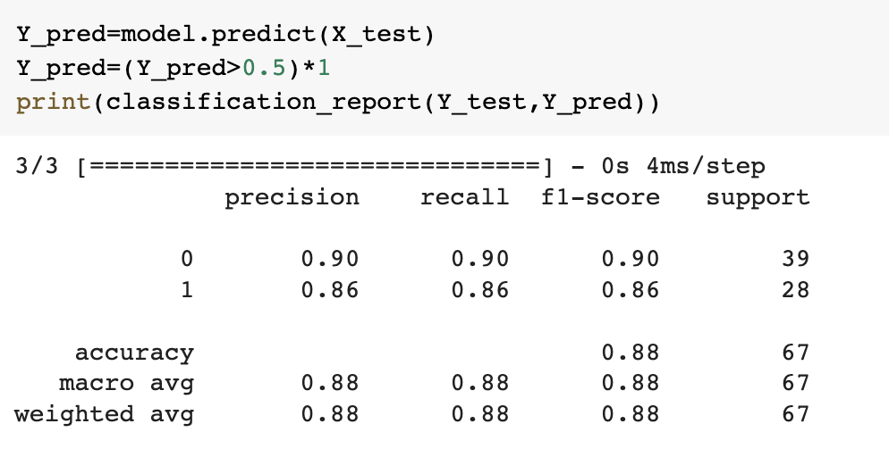
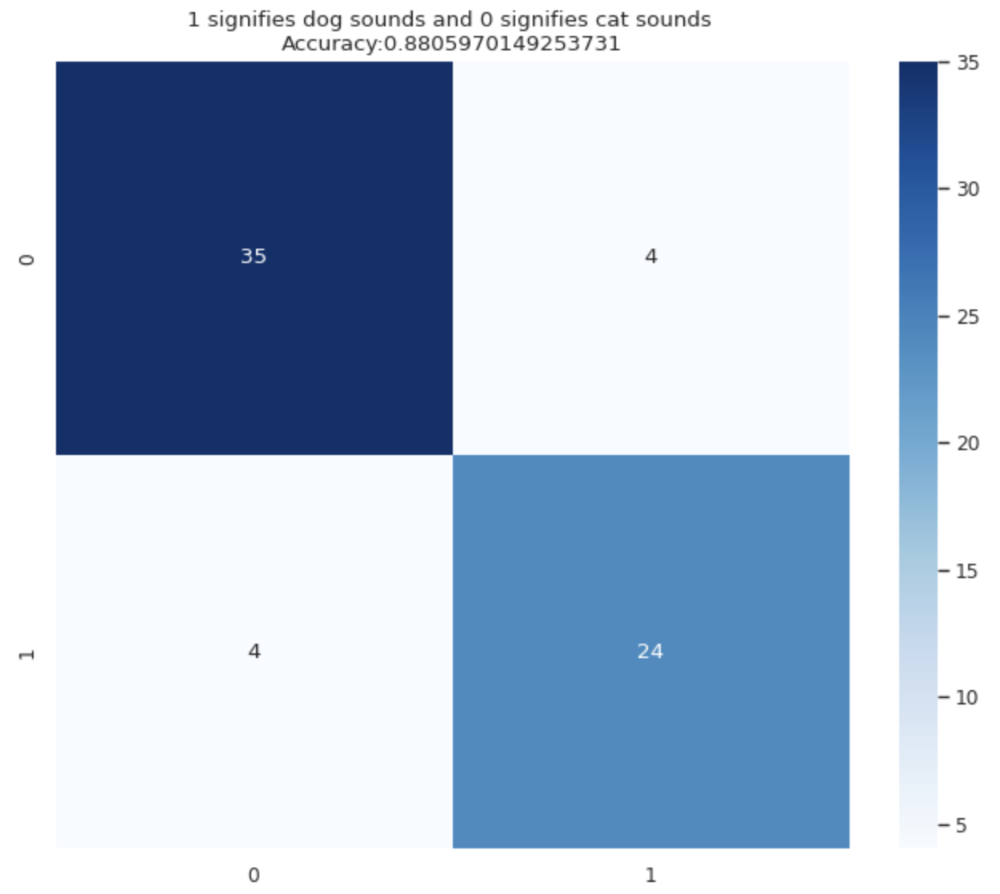
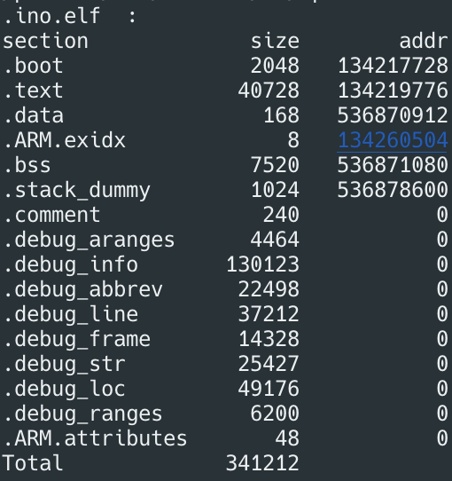

# 
Porjet de reconnaisance de sons

 
## Membres de l'équipe

- Tom Bevan    
- Jules Prince

## Description du projet

### Contexte

Le sujet de notre projet était de créer un modèle de classification de sons de chiens et de chats à partir d'enregistrements audio pour ensuite le mettre sur une carte Nucleo-64 STM32L476 et donc avoir de l'IA embarquée. Pour ce faire nous avons premièrement dû nous charger de trouver un dataset avec assez de données pour pouvoir entrainer efficacement notre réseau de neuronnes. Nous avons donc utilisé la base de données 'Audio Cats and Dogs' trouvée sur le site Kaggle (https://www.kaggle.com/datasets/mmoreaux/audio-cats-and-dogs) que nous avons complétée avec d'autres enregistrements pour garder un nombre équivalent d'enregistrements pour chaque classes.
Ainsi, notre dataset final comportait, 2 classes (chien/chat) avec XXX enregistrements par classes d'apprentissage et XXX enregistrements par classes de test (total de XXX enregistrements dont XXX d'apprentissage et XXX de test).

### Objectifs 

L'objectif principal de ce projet est de développer un modèle capable de classifier en temps réel, les sons de chiens et de chats avec une précision élevée tout en prenant en compte les restriction matérielles (RAM/Stockage/batterie) posées par la carte Nucleo-64 STM32L476.

### Environement de test

Dans notre code, nous avons utilisé les librairies python suivantes :

- pandas pour la manipulation de données ;
- numpy pour le calcul numérique ;
- os pour l'interaction avec le système d'exploitation ;
- librosa pour le traitement des signaux audio ;
- tensorflow pour la construction et l'entraînement du modèle ;
- matplotlib et seaborn pour la visualisation des données.

Cela nous a permis de tester l'efficacité du réseau de neuronnes lors de nos différentes modifactions visant à réduire au maximum l'impacte mémoire/batterie sur la carte.

## Description du workflow

Le code commence par importer les bibliothèques nécessaires et définir les chemins des dossiers contenant les fichiers audio (.wav). Il utilise ensuite os pour itérer sur tous les fichiers audio dans ces dossiers, extraire les caractéristiques audio importantes avec librosa, puis stocker ces caractéristiques et les étiquettes correspondantes dans des tableaux pandas.

Après avoir préparé les données, le modèle CNN est construit avec TensorFlow en utilisant des couches denses pour effectuer la classification. Les données d'entraînement sont alors ajustées au modèle, et l'historique de l'entraînement est visualisé pour évaluer la performance du modèle. Finalement, le modèle est testé sur les données de test, et les résultats de la classification sont affichés.

## Description du modèle CNN

Le modèle CNN est construit avec TensorFlow en utilisant des couches denses pour effectuer la classification des sons de chiens et de chats. Le modèle comprend des couches de convolution pour extraire des caractéristiques à partir des données audio en entrée. Ensuite, ces caractéristiques sont fournies à des couches denses pour effectuer la classification.

Plus précisément, Ce modèle est un réseau de neurones prend en entrée des séquences de 100 points unidimensionnels et utilise une couche de convolution pour extraire les caractéristiques importantes de la séquence. Il réduit la dimensionnalité des données avec une couche de pooling et prédit la classe de la séquence avec une couche de sortie binaire grace à la fonction sigmoid.

Le modèle a été compilé avec l'optimiseur "Adam" et une fonction de coût de type "categorical_crossentropy". Les données d'entraînement sont ajustées au modèle avec une taille de batch de 32 et pour un total de 50 époques. La validation croisée est utilisée pour évaluer la performance du modèle, en utilisant 20% des données d'entraînement pour la validation.

Les résultats ont montré que le modèle était capable de classifier avec précision les sons de chiens et de chats, avec une précision moyenne de 88% sur les données de test. Cependant, l'empreinte mémoire du modèle était encore trop grande pour être utilisée efficacement sur la carte Nucleo-64 STM32L476, ce qui a nécessité plusieurs optimisations pour améliorer sa performance.

## Analyse des resultats
### Performance

notre modèle nous amène à une performance de 88% sur les données de test.

  

La matrice de confusion nous donné un résultat tres satisfaisant.

  

### Impact sur la mémoire

Le programme sur la carte occupe l'espace suivant 

 

RAM : 40896 octets

ROM : 42944 octets

### Latence

Nous avons mesuré une lattence de 27ms

### Consomation d'énergie et analyse de la durée de vie de la batterie
Nous allons maintenant mesuré la consommation en mode actif de la carte :

Consommation d’énergie en mode actif : 14,1 mW

La fréquence de récuperations de données avec T = 2,56s F = 0,39Hz

Consommation d'énergie moyenne par inférence = (14,1 mW * T) / (T + 2,56 s) = 0,202 mW

Autonomie avec mode veille = Énergie de la batterie / Consommation d'énergie moyenne par inférence = 316,8 mWh / 0,202 mW = 1564,36 heures

Autonomie sans mode veille = Énergie de la batterie / Consommation d'énergie en mode actif = 316,8 mWh / 14,1 mW = 22,47 heures

## Conclusion et évolutions

Après avoir réalisé ce projet, nous pouvons dire que le modèle CNN que nous avons développé a atteint notre objectif principal en classifiant efficacement les sons de chiens et de chats avec une précision élevée, même dans des conditions d'environnement sonore variables.

Cependant, nous avons constaté que la mise en œuvre du modèle sur la carte Nucleo-64 STM32L476 a posé des défis uniques, en particulier en termes de restrictions de mémoire et de consommation d'énergie. En effet, le modèle nécessite une grande quantité de mémoire pour effectuer les calculs, ce qui a eu un impact sur la durée de vie de la batterie.

Pour résoudre ce problème, nous avons effectué plusieurs optimisations, telles que l'utilisation de couches de convolution pour réduire la taille des données en entrée, la réduction du nombre de couches du modèle pour limiter la complexité et le nombre de neurones et ainsi diminuer l'utilisation de la mémoire.

Ces améliorations ont permis de réduire l'empreinte mémoire de notre modèle, améliorant ainsi l'efficacité de son utilisation sur la carte Nucleo-64 STM32L476. Cependant, il reste encore des améliorations à apporter pour améliorer la durée de vie de la batterie.

En conclusion, ce projet a été une expérience intéressante pour nous, et nous avons appris beaucoup de choses sur la mise en œuvre de réseaux de neurones sur des plates-formes embarquées. Nous sommes convaincus que ce travail pourra être amélioré et nous sommes impatients de continuer à développer des modèles de classification pour d'autres types de données.
